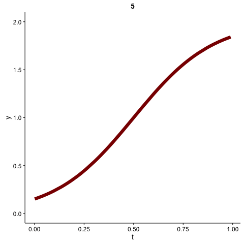
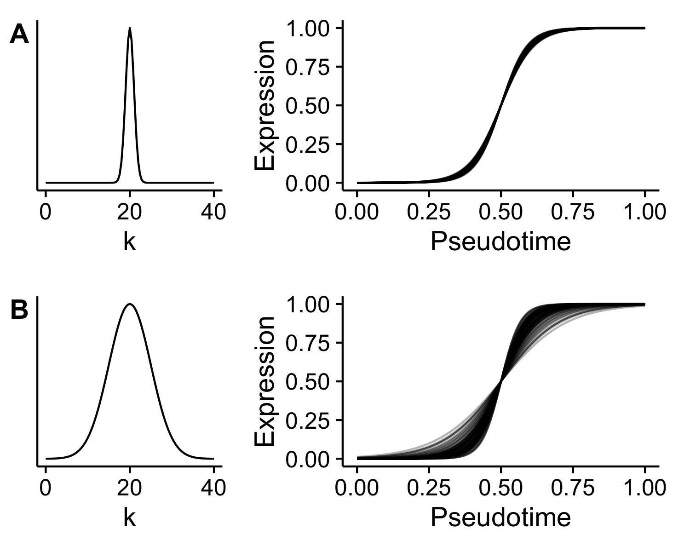
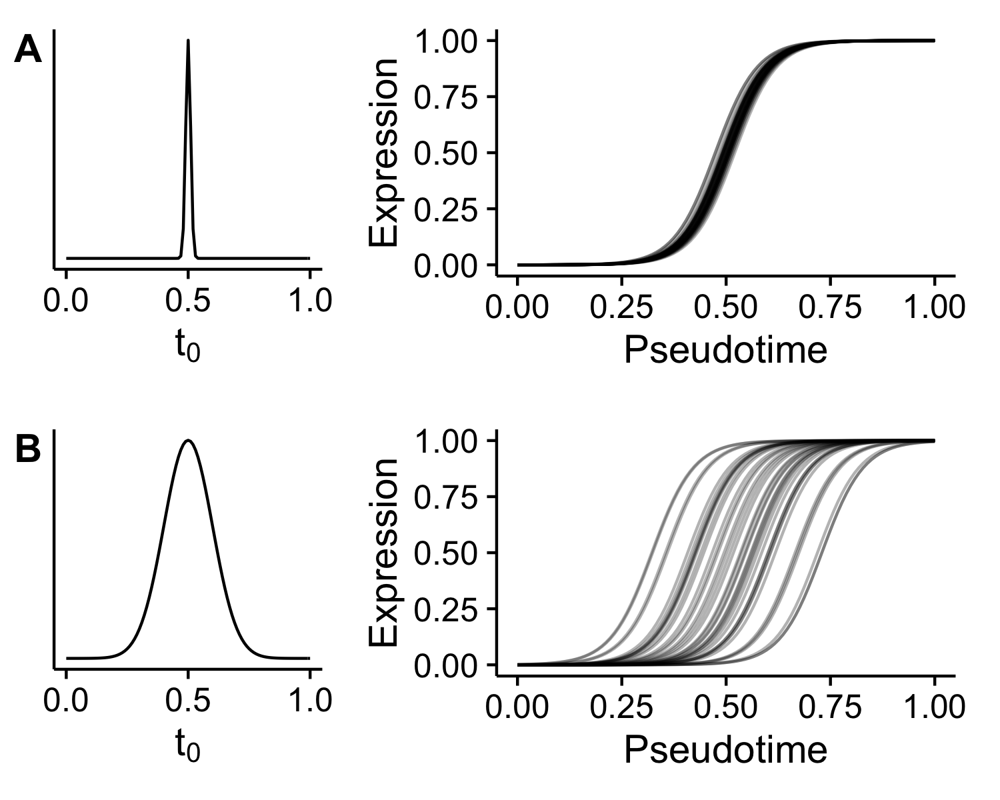

# Ouija

R package for Bayesian non-linear factor analysis for incorporating prior knowledge in single-cell trajectory learning.

## Getting started

### Installation

```R
# install.packages("devtools")
devtools::install_github("kieranrcampbell/ouija")
```

### Model fitting

Input is a cell-by-gene expression matrices that is non-negative and represents logged gene expression values. We recommend using `log2(TPM + 1)`.

```R
library(ouija)
data(synth_gex) # synthetic gene expression data bundled
```

Prior expectations in Ouija are encoded by whether we expect genes to turn on or
off along the trajectory through the `k_means` parameter, with one for each gene.
This is discussed further below.

```
strengths <- 5 * c(1, -1, 1, -1, -1, -1)
oui <- ouija(synth_gex, strengths)
```

### Plotting

Since we've performed MCMC inference we should check the convergence:

```R
plot(oui, what = "diagnostic")
```


We can then plot the gene behaviour at the MAP pseudotime estimates:

```R
plot(oui, what = "behaviour")
```


An informative way to understand the uncertainty in the ordering is to look at
the gene expression trace plot:

```R
plot(oui, what = "heatmap")
```


## Incorporating prior information

Ouija assumes gene expression across pseudotime will follow a particular pattern known as a sigmoid. This is a very general pattern that accounts for virtually all forms of monotonically increasing / decreasing expression, but is also very powerful in that we can place priors on where in a trajectory a gene turns on or off and how quickly it turns on or off. We discuss each of these separately below.

### Activation strength

The activation strength parameter (known in the statistical model as $k$) dictates how quickly a gene turns on or off. A large magnitude means the gene turns on/off quickly, while a small magnitude means the gene turns on/off slowly (and in some cases, approximately linearly). The sign of the strength parameter dictates whether the gene turns on (positive) or off (negative) along the trajectory. Examples for various $k$ are in the gif below.



To incorporate prior information about the activation strength we place a $N(\mu_k, \sigma_k)$ prior on $k$ _for each gene_. The mean parameter $\mu_k$ describes the expected behaviour as above, while the standard deviation parameter $\sigma_k$ controls how sure we are of this behaviour.

For example, if we expect a gene to turn on quickly, we may impose $\mu_k = 20$. If we are sure of this we would then place a small standard deviation on this, e.g. $\sigma_k = 1$, while if we are not sure we may place a more diffuse standard deviation, e.g. $\sigma_k = 5$. These two examples are shown below in plots *A* and *B* respectively.



The parameters are encoded in the `ouija` function via the parameters `strengths` and `strength_sd` for $\mu_k$ and $\sigma_k$ respectively.

### Activation time

The activation time (known in the statistical model as $t_0$) tells us where in the trajectory a gene turns on or off. The pseudotimes are defined between 0 and 1, so if $t_0 = 0$ then we expect the behaviour to occur at the start of the trajectory, $t_0 = 0.5$ it would occur in the middle and $t_0 = 1$ it would occur towards the end. Examples for various $t_0$ are shown in the gif below.


To incorporate prior knowledge of $t_0$ we place a $N(\mu_t, \sigma_t)$ prior on it. As before, $\mu_t$ gives is the expected position in the trajectory, while $\sigma_t$ tells us how sure of this we are. Examples are shown below for a gene we expect to turn on in the middle of the trajectory ($\mu_t = 0.5$), and two situations where we are very sure of this $\sigma_t = 0.1$ and not so sure $\sigma_t = 1$ in *A* and *B* respectively.



The parameters are encoded in the `ouija` function via the parameters `times` and `time_sd` for $\mu_t$ and $\sigma_t$ respectively.

## Authors

Kieran Campbell & Christopher Yau  
Wellcome Trust Centre for Human Genetics, University of Oxford

## Artwork


