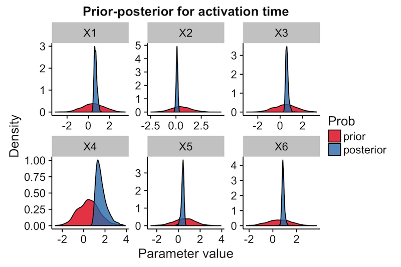

# Ouija

Ouija is a statistical framework for learning pseudotimes from single-cell RNA-seq data using only small panels of marker genes and prior knowledge of gene behaviour. The user can place priors on whether a given gene is up or down regulated along a trajectory, as well as where in the trajectory the regulation happens. Under-the-hood Ouija uses Bayesian hierarchical nonlinear factor analysis as implemented in the probabilistic programming language [Stan](http://mc-stan.org).

## Getting started

### Installation

```R
# install.packages("devtools")
devtools::install_github("kieranrcampbell/ouija")
```

To build the Ouija vignette install using

```R
devtools::install_github("kieranrcampbell/ouija", build_vignettes = TRUE)
```

### Model fitting

Input is a cell-by-gene expression matrices that is non-negative and represents logged gene expression values. We recommend using `log2(TPM + 1)`.

```R
library(ouija)
data(synth_gex) # synthetic gene expression data bundled
```

Prior expectations in Ouija are encoded by whether we expect genes to turn on or
off along the trajectory through the `k_means` parameter, with one for each gene.
This is discussed further below.

```
strengths <- 5 * c(1, -1, 1, -1, -1, -1)
oui <- ouija(synth_gex, strengths)
```

Ouija also supports Variational Bayes using the `inference_type = "vb"` argument in `ouija`. For more details see the vignette.

### Plotting

Since we've performed MCMC inference we should check the convergence:

```R
plot(oui, what = "diagnostic")
```


We can then plot the gene behaviour at the MAP pseudotime estimates:

```R
plot(oui, what = "behaviour")
```


An informative way to understand the uncertainty in the ordering is to look at
the gene expression trace plot:

```R
plot(oui, what = "heatmap")
```


We can also plot how the prior compares to the posterior over the activation parameters, such as strength or time:

```R
plot(oui, what = "pp")
```



### Extracting the pseudotimes

#### Point estimates

[MAP](https://en.wikipedia.org/wiki/Maximum_a_posteriori_estimation) estimates (ie point estimates) may be extracted using the `map_pseudotime` function for further downstream analysis:

```R
t_map_estimate <- map_pseudotime(oui)
```

For example, if you're working with an `SCESet` object from the [scater](http://github.com/davismcc/scater) package, you could add this as a new variable in the phenotype data slot:

```R
pData(sce)$Pseudotime <- map_pseudotime(oui)
```

If you wish to take a more Bayesian approach, the full set of pseudotime samples can be extracted from the underlying `stanfit` object, which is held in the `$fit` position of any `ouija_fit` object. The pseudotimes are encoded in the parameter `t`. To get the sample-by-cell matrix:

```R
posterior_pseudotime_traces <- rstan::extract(oui$fit, "t")$t
```

#### Posterior errors

One of the advantages in performing a Bayesian pseudotime analysis is that we can quantify the posterior uncertainty in the pseudotimes of each cell. To do this we can find the highest probability density (HPD) [credible interval](https://en.wikipedia.org/wiki/Credible_interval), which can be thought of as the Bayesian equivalent of a confidence interval. However, unlike a confidence interval, it *does* have the interpretation that there's a 95% chance the parameter (here the pseudotimes) will fall within the interval. To find the credible interval call

```R
cred_int <- pseudotime_error(oui)
```

which returns a matrix with two columns, with the first column corresponding to the lower interval and the second corresponding to the upper interval. By default the interval probability is 95%, but this can be adjusted using the `prob` parameter.


## Incorporating prior information

Ouija assumes gene expression across pseudotime will follow a particular pattern known as a sigmoid. This is a very general pattern that accounts for virtually all forms of monotonically increasing / decreasing expression, but is also very powerful in that we can place priors on where in a trajectory a gene turns on or off and how quickly it turns on or off. We discuss each of these separately below.

### Activation strength

The activation strength parameter (known in the statistical model as *k*) dictates how quickly a gene turns on or off. A large magnitude means the gene turns on/off quickly, while a small magnitude means the gene turns on/off slowly (and in some cases, approximately linearly). The sign of the strength parameter dictates whether the gene turns on (positive) or off (negative) along the trajectory. Examples for various *k* are in the gif below.


To incorporate prior information about the activation strength we place a *N(μ<sub>k</sub>, σ<sub>k</sub>)* prior on *k* for each gene. The mean parameter *μ*<sub>k</sub> describes the expected behaviour as above, while the standard deviation parameter *σ<sub>k</sub>* controls how sure we are of this behaviour.

For example, if we expect a gene to turn on quickly, we may impose *μ<sub>k</sub> = 20*. If we are sure of this we would then place a small standard deviation on this, e.g. *σ<sub>k</sub> = 1*, while if we are not sure we may place a more diffuse standard deviation, e.g. *σ<sub>k</sub> = 5*. These two examples are shown below in plots *A* and *B* respectively.


The parameters are encoded in the `ouija` function via the parameters `strengths` and `strength_sd` for *μ<sub>k</sub>* and *σ<sub>k</sub>* respectively.

### Activation time

The activation time (known in the statistical model as *t<sub>0</sub>*) tells us where in the trajectory a gene turns on or off. The pseudotimes are defined between 0 and 1, so if *t<sub>0</sub> = 0* then we expect the behaviour to occur at the start of the trajectory, *t<sub>0</sub> = 0.5* it would occur in the middle and *t<sub>0</sub> = 1* it would occur towards the end. Examples for various *t<sub>0</sub>* are shown in the gif below.


To incorporate prior knowledge of *t<sub>0</sub>* we place a *N(μ<sub>t</sub>, σ<sub>t</sub>)* prior on it. As before, *μ<sub>t</sub>* gives is the expected position in the trajectory, while *σ<sub>t</sub>* tells us how sure of this we are. Examples are shown below for a gene we expect to turn on in the middle of the trajectory (*μ<sub>t</sub> = 0.5*), and two situations where we are very sure of this *σ<sub>t</sub> = 0.1* and not so sure *σ<sub>t</sub> = 1* in *A* and *B* respectively.


The parameters are encoded in the `ouija` function via the parameters `times` and `time_sd` for *μ<sub>t</sub>* and *σ<sub>t</sub>* respectively.

## Authors

Kieran Campbell & Christopher Yau  
Wellcome Trust Centre for Human Genetics, University of Oxford

## Artwork


