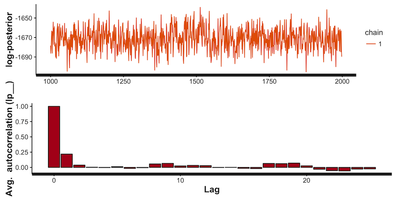
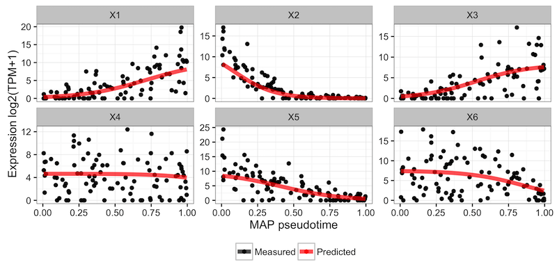
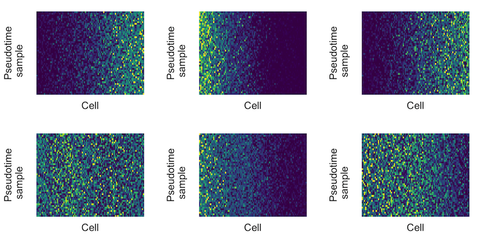

# Ouija

R package for Bayesian non-linear factor analysis for incorporating prior knowledge in single-cell trajectory learning.

Full vignette can be found [here](http://kieranrcampbell.github.io/ouija).

## Getting started

### Installation

```R
# install.packages("devtools")
devtools::install_github("kieranrcampbell/ouija")
```

### Model fitting

Input is a cell-by-gene expression matrices that is non-negative and represents logged gene expression values. We recommend using `log2(TPM + 1)`.

```R
library(ouija)
data(synth_gex) # synthetic gene expression data bundled
```

Prior expectations in Ouija are encoded by whether we expect genes to turn on or
off along the trajectory through the `k_means` parameter, with one for each gene.
A positive value implies the gene will turn on over pseudotime while a negative
value implies the gene switches off. The magnitude indicates how quickly
we expect this to happen.

```
strengths = 5 * c(1, -1, 1, -1, -1, -1)
oui <- ouija(synth_gex, strengths)
```

### Plotting

Since we've performed MCMC inference we should check the convergence:

```R
plot(oui, what = "diagnostic")
```



We can then plot the gene behaviour at the MAP pseudotime estimates:

```R
plot(oui, what = "map")
```



An informative way to understand the uncertainty in the ordering is to look at
the gene expression trace plot:

```R
plot(oui, what = "trace")
```




## Authors

Kieran Campbell & Christopher Yau  
Wellcome Trust Centre for Human Genetics, University of Oxford

