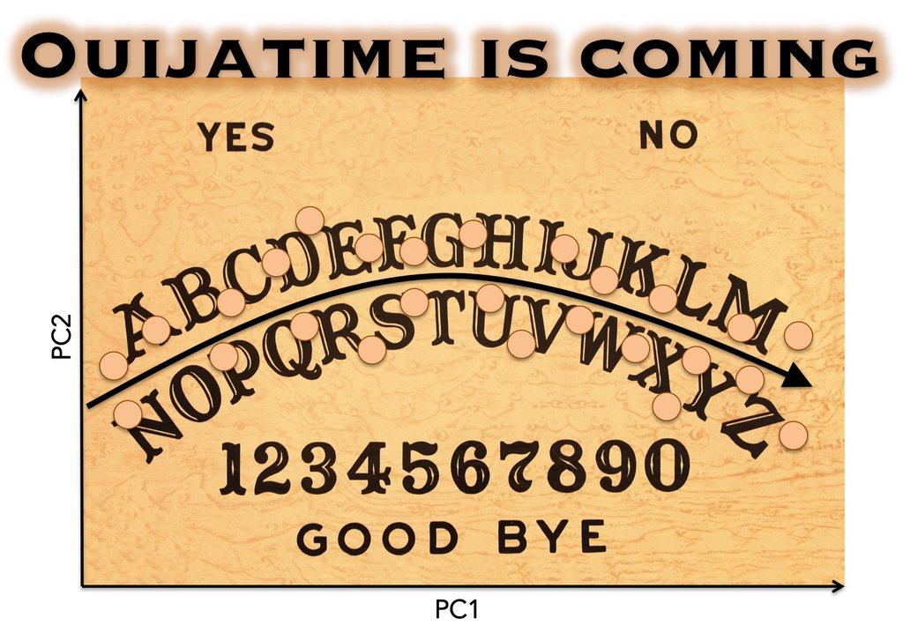

# Ouija

[](https://travis-ci.org/kieranrcampbell/ouija)


Ouija is a probabilistic pseudotime framework. Ouija 

* infers pseudotimes from a **small number of marker genes** letting you understand **why** the pseudotimes have been learned in terms of those genes (**A**)
* provides parameter estimates (with uncertainty) for **interpretable gene regulation behaviour** (such as the peak time or the upregulation time) (**B**)
* has a Bayesian hypothesis test to **find genes regulated before others** along the trajectory (**C**)
* identifies **metastable states**, ie discrete cell types along the continuous trajectory (**D**)


## Getting started

### Installation

```r
# install.packages("devtools")
devtools::install_github("kieranrcampbell/ouija")
```

To build the Ouija vignette install using

```r
devtools::install_github("kieranrcampbell/ouija", local = FALSE, 
                          args = "--preclean", build_vignettes = TRUE)
```

### Model fitting

Input is a cell-by-gene expression matrices that is non-negative and represents logged gene expression values. We recommend using `log2(TPM + 1)`. This can either take the form of a matrix or an `ExpressionSet` such as from the [scater](https://bioconductor.org/packages/release/bioc/html/scater.html) package:

```r
library(ouija)
data(synth_gex) # synthetic gene expression data bundled
oui <- ouija(synth_gex)
pseudotimes <- map_pseudotime(oui)
```

For further usage options see the vignette. A prebuilt vignette can be found [here](http://kieranrcampbell.github.io/ouija).


## Authors

Kieran Campbell & Christopher Yau  
Wellcome Trust Centre for Human Genetics, University of Oxford

## Artwork




