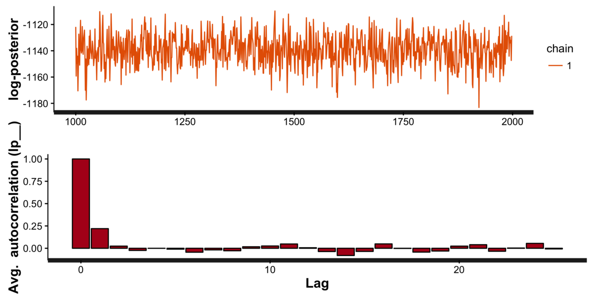
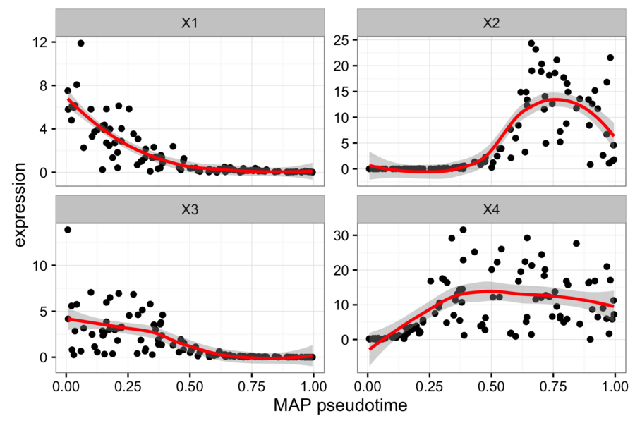
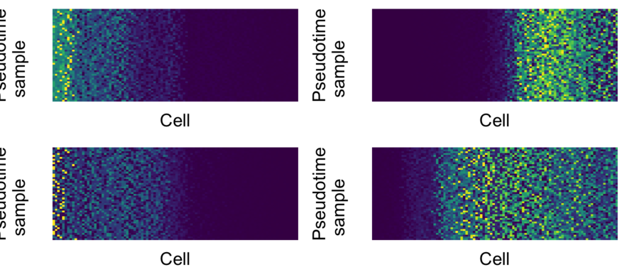

# BNLFA

R package for Bayesian non-linear factor analysis for incorporating prior knowledge in single-cell trajectory learning.

Full vignette can be found [here](http://kieranrcampbell.github.io/bnlfa).

## Installation

```R
# install.packages("devtools")
devtools::install_github("kieranrcampbell/bnlfa")
```

## Usage

### Model fitting

Input gene expression matrices should be positive and represent logged gene expression values. We recommend using `log2(TPM + 1)`.

```R
## Using gene expression matrix Y, specify direction (off or on)
## of each gene using 'sign_bits' (-1 -> off, 1 -> on)
sign_bits <- c(-1, 1, -1, 1)

bm <- bnlfa(Y, prior = "sign", sign_bits = sign_bits)
```

### Plotting

Plot diagnostics:

```R
plot(bm, what = "diagnostic")
```



Plot MAP gene behaviour:

```R
plot(bm, what = "map")
```



Plot pseudotime trace heatmap:

```R
plot(bm, what = "trace")
```




## Authors

Kieran Campbell & Christopher Yau  
Wellcome Trust Centre for Human Genetics, University of Oxford

